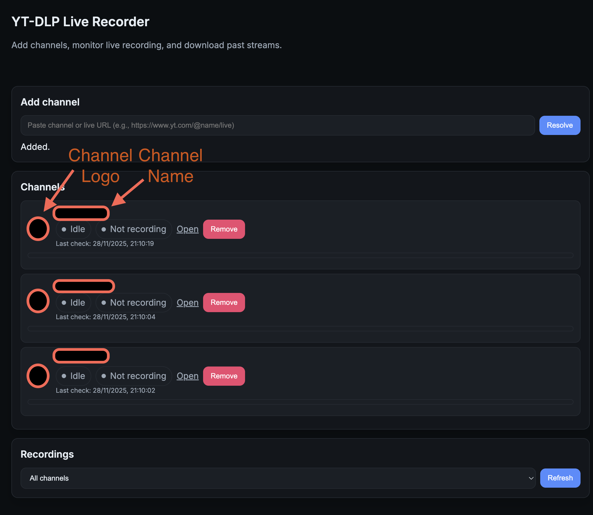

# YT-FOMO

Dark-mode web UI and service that records live streams from YT channels while they are live, so you don't miss them if they later become unavailable. Multi‑channel capable, per‑channel folders, progress display, and a lightweight API.

## Features

- Add channels via URL; resolver confirms the channel and avatar
- Per‑channel watcher threads with:
  - live‑only detection and fast retry window after a stream ends
  - exponential backoff on probe failures
  - progress display (percent, ETA, filename) when recording
- Per‑channel output folders under `/downloads/<channel_name>/...`
- Recordings list with Download and Delete actions
- Optional notifications via Gotify (start/end)
- Observability:
  - `/api/status` current state
  - `/api/logs?channel_id=...` recent watcher logs
  - `/api/metrics` simple status metrics
  - `/healthz` healthcheck
- Optional retention and cleanup:
  - max days, max per‑channel size (delete oldest first), stale `.part` cleanup
- yt‑dlp kept up to date:
  - update after each recording (serialized across channels)
  - daily update when idle



## Quickstart (Docker Compose)

1) Create folders for data and downloads (these are mounted inside the container):

```bash
mkdir -p downloads data
```

2) (Optional) Copy the example env and adjust values:

```bash
cp .env.example .env
# edit .env to set HOST_PORT, GOTIFY_URL/TOKEN, retention, etc.
```

3) Start:

```bash
docker compose up -d --build
```

4) Open the UI:

```
http://localhost:8090
```

Paste a channel (or live) URL, click Resolve to confirm, then Add. The channel will appear with live/recording status and any current progress. Recordings will appear in the list and inside `./downloads/<channel_name>/` on your host.

## Configuration

Compose uses standard variable substitution. You can set these in a `.env` file or export them in your shell before `docker compose up`:

- `HOST_PORT` (default `8090`): host port for the UI/API
- `INTERVAL_SECONDS` (default `60`): probe interval when not live
- `GOTIFY_URL`, `GOTIFY_TOKEN`: enable start/end notifications
- `TZ` (default `UTC`): timezone inside the container
- Retention (optional; `0` disables each rule):
  - `RETAIN_MAX_DAYS` (default `0`)
  - `RETAIN_MAX_SIZE_GB` (default `0`), per‑channel cap, deletes oldest first
  - `CLEAN_PART_AGE_HOURS` (default `0`), remove stale `.part` files

Volumes:

- `./downloads:/downloads` for saved recordings
- `./data:/data` for channel configuration

## Endpoints (quick reference)

- `GET /` UI
- `GET /downloads/...` static files (recordings)
- `GET /api/resolve?url=...` resolve channel info
- `GET /api/channels` list
- `POST /api/channels` add
- `DELETE /api/channels/{id}` remove
- `GET /api/status` watchers status
- `GET /api/recordings?channel_id=...` list recordings
- `DELETE /api/recordings?path=...` delete a recording
- `GET /api/logs?channel_id=...` recent log lines
- `GET /api/metrics` status metrics
- `GET /healthz` healthcheck

## Notes

- Branding and UI avoid platform‑specific names; the service detects platform via URLs internally.
- The watchers only record while a stream is live; after a successful recording, they quickly re‑probe for a short window to catch immediate restarts.
- yt‑dlp is updated after each recording and once daily when idle, ensuring compatibility.

## Development

Standard container workflow:

```bash
docker compose up -d --build
docker compose logs -f yt-fomo
```

To stop:

```bash
docker compose down
```

## License

MIT

